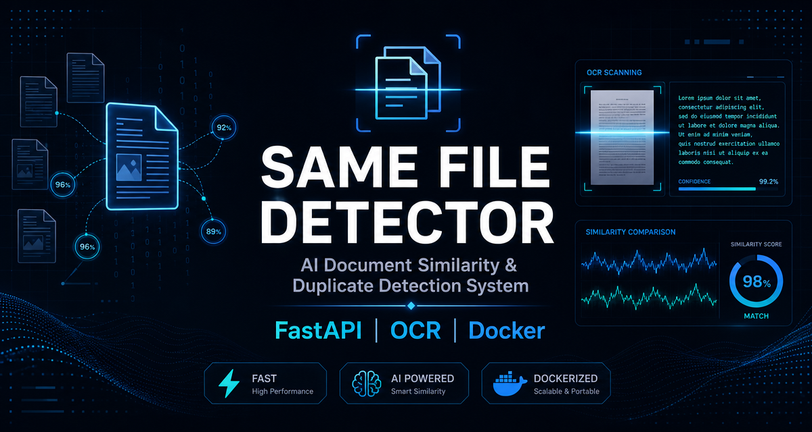

# 🔍 Same File Detector


## AI-Powered Document Similarity & Duplicate File Detection System

Same File Detector is a document intelligence platform designed to identify duplicate and similar files using OCR, text extraction, and fuzzy similarity analysis.

The system allows users to upload:

* **BASE documents** — reference files
* **COMPARE documents** — files to analyze

and automatically classifies documents as:

* ✅ **EXACT** — Documents have identical content
* ⚠️ **SIMILAR** — Documents contain highly matching content
* ❌ **DIFFERENT** — Documents have low similarity

The platform supports multiple document formats including PDF, DOCX, XLSX, PPTX, TXT, CSV, JSON, and image files.

---

# ⭐ Support This Project

If you find this project useful, consider giving it a ⭐ star on GitHub.

Your support helps improve the project and motivates future development.

⭐ Star the repository:

https://github.com/HuzaifaAIDev/Same_file_detector

---

# ✨ Project Highlights

* 🔍 Intelligent document similarity detection
* 📄 Multi-format document processing
* 🤖 OCR support for scanned documents
* 🔐 Secure authentication system
* 👨‍💼 Admin management dashboard
* 📚 REST API with Swagger documentation
* 🐳 Docker deployment support
* 📊 Comparison history tracking

---

# 📸 Application Preview

## 🔐 Authentication

### Sign In

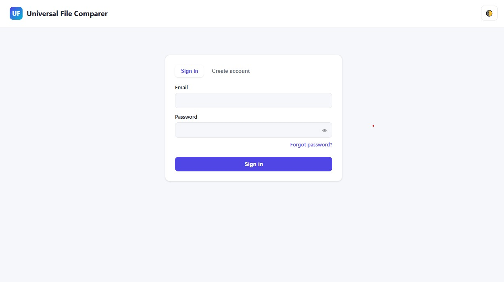

### Create Account

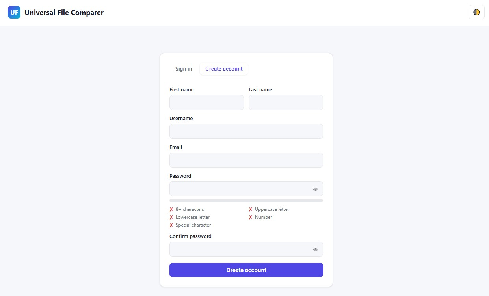

### Email OTP Verification

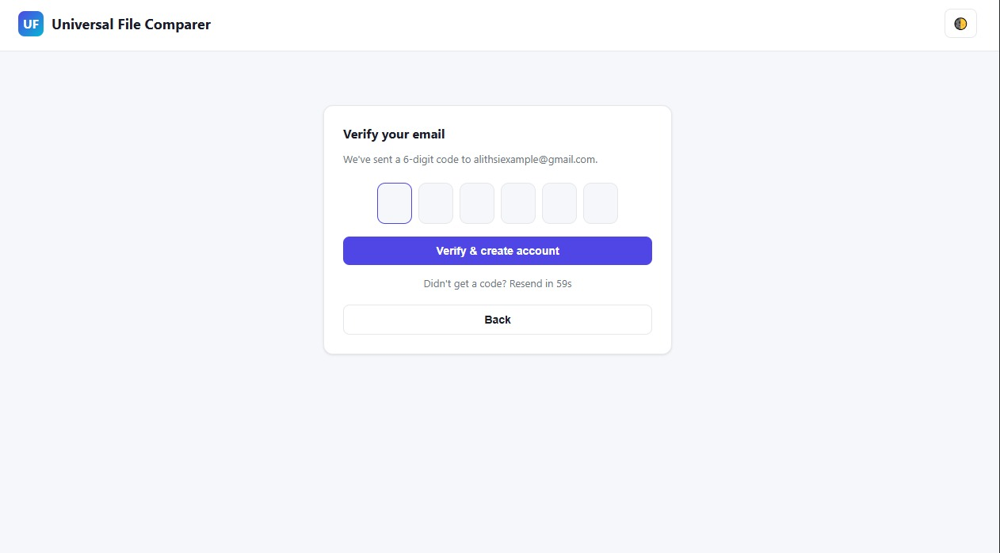

### Password Reset

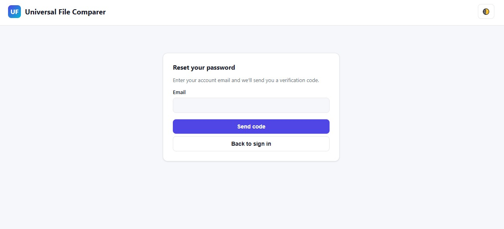

---

# 👤 User Dashboard

### User Dashboard

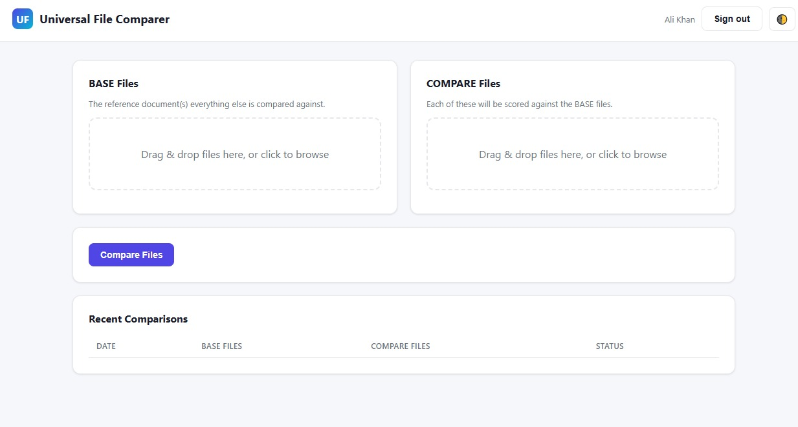

### Select Files For Comparison

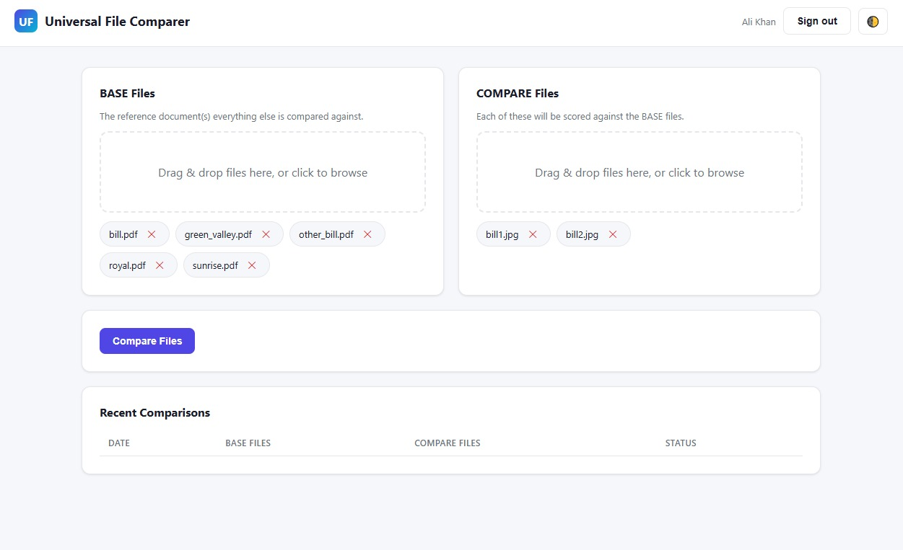

### Comparison Results

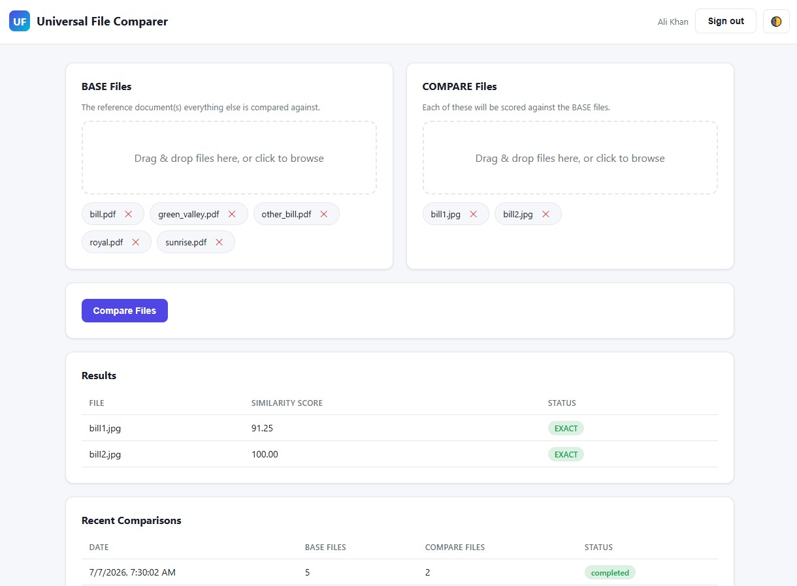

---

# 👨‍💼 Admin Panel

### Admin Dashboard

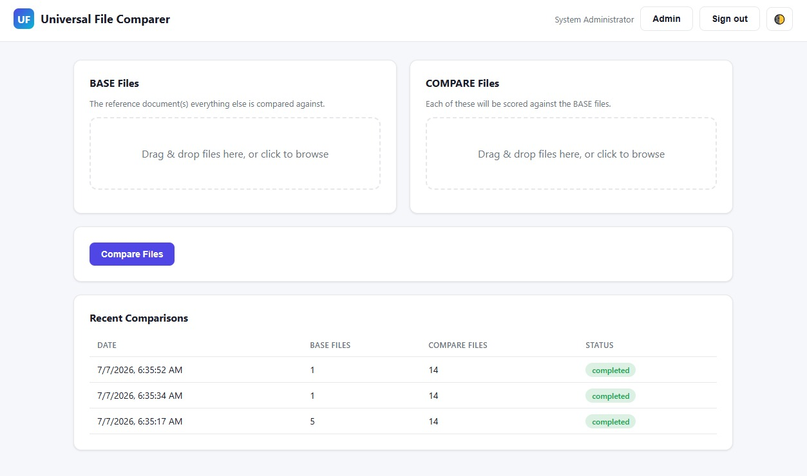

### User Management - Light Theme

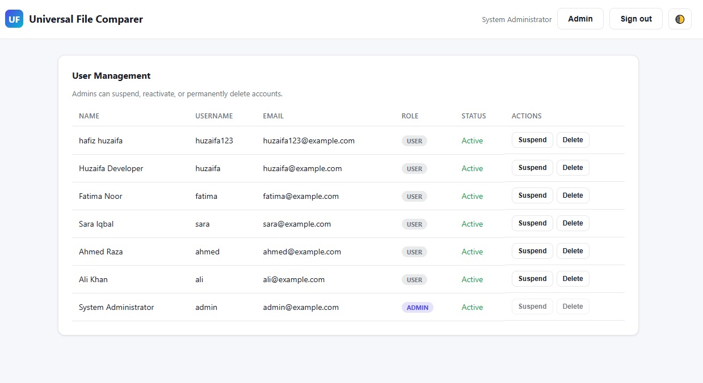

### User Management - Dark Theme

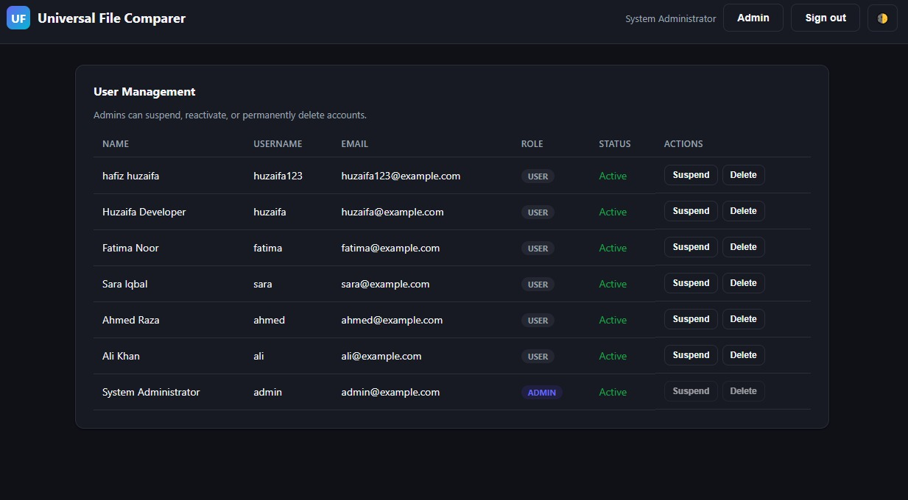

---

# 📚 API Documentation

Built using FastAPI Swagger documentation.

### Swagger Overview

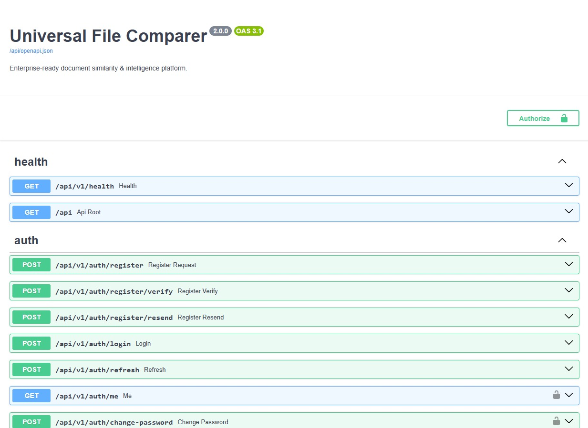

### Authentication, Admin & Compare APIs

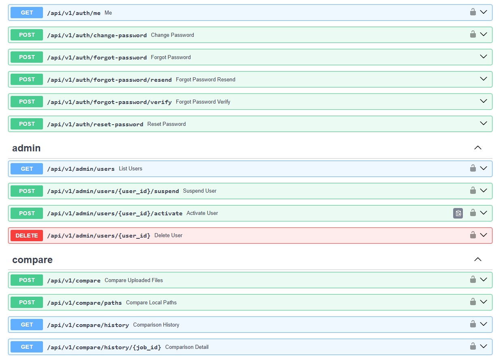

### Compare API Interface

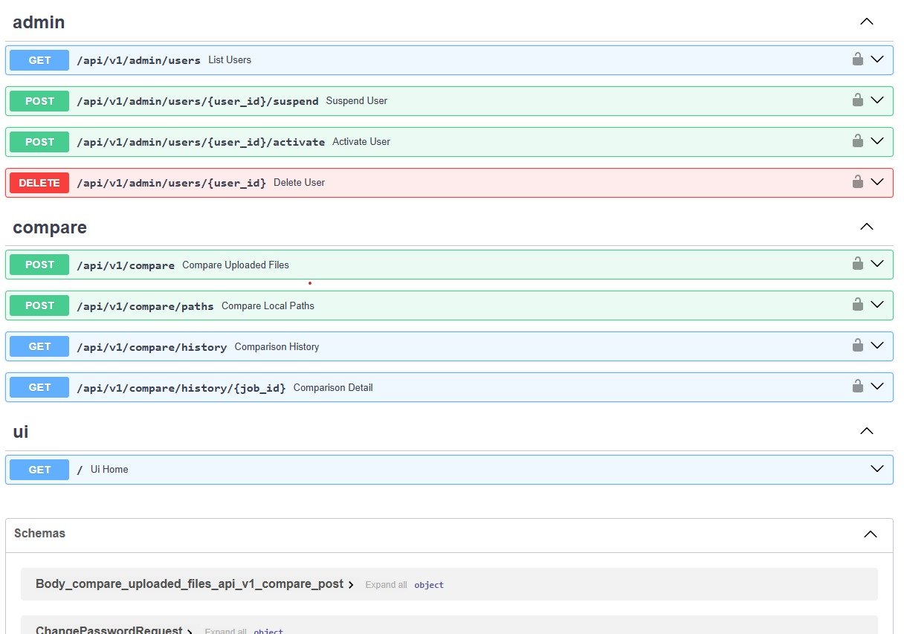

### API Schemas

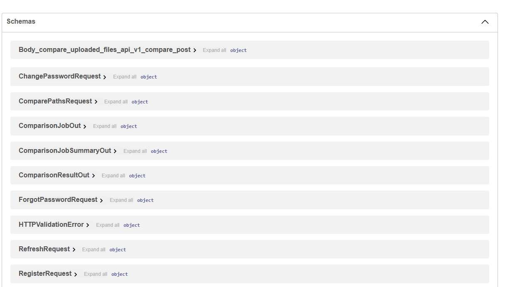

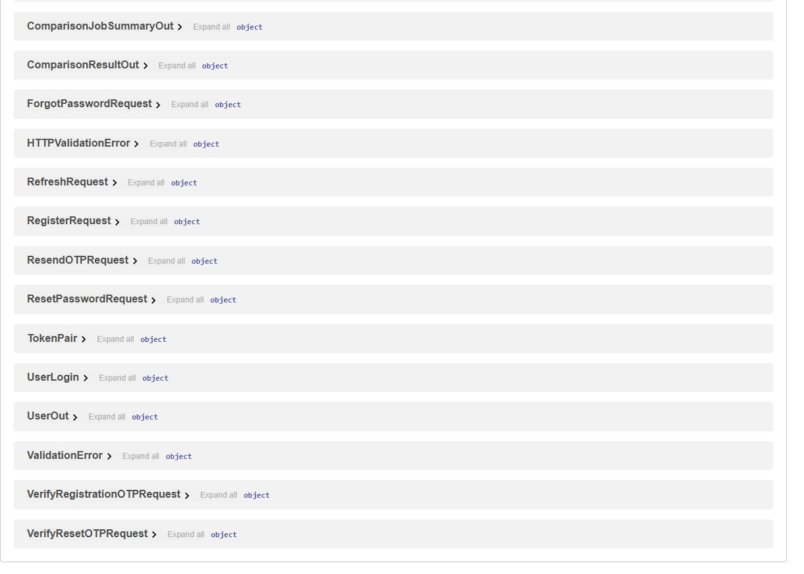

---

# 🚀 Features

## 📂 Document Comparison Engine

* Upload multiple BASE and COMPARE files
* Extract document content automatically
* Compare documents using similarity matching
* Calculate similarity percentage
* Generate comparison results
* Maintain comparison history

---

## 🤖 Document Intelligence

* OCR extraction from images and scanned PDFs
* Text extraction from multiple file formats
* Fuzzy text similarity matching
* Content-based comparison
* Automated classification

---

## 🔐 Authentication & Security

* JWT authentication
* Secure password hashing using bcrypt
* Email OTP verification
* Password reset workflow
* Role-based access control
* Security headers middleware
* Input validation
* Upload restrictions
* Rate limiting protection

---

## 👨‍💼 Admin Features

* Admin dashboard
* User management
* Account activation/suspension
* Protected admin endpoints
* User monitoring

---

# 🏗️ System Architecture

```text
Same_file_detector/

│
├── backend/
│   └── app/
│       ├── api/
│       │   └── Authentication, Admin, Compare APIs
│       │
│       ├── core/
│       │   └── Config, Security, JWT, OTP
│       │
│       ├── models/
│       │   └── Database Models
│       │
│       ├── services/
│       │   ├── OCR Processing
│       │   ├── File Extraction
│       │   └── Similarity Engine
│       │
│       ├── repositories/
│       │   └── Database Operations
│       │
│       └── main.py
│
├── frontend/
│   ├── templates/
│   ├── static/css/
│   └── static/js/
│
├── assets/
│   ├── banner.png
│   └── screenshots
│
├── Dockerfile
├── docker-compose.yml
└── README.md
```

---

# 🛠️ Technology Stack

## Backend

* Python
* FastAPI
* SQLAlchemy
* Pydantic
* JWT Authentication
* bcrypt

## Document Processing

* PyMuPDF
* Tesseract OCR
* Pillow
* RapidFuzz

## Frontend

* Jinja2 Templates
* JavaScript
* HTML5
* CSS3

## Database & Deployment

* SQLite
* PostgreSQL
* Docker
* Docker Compose

---

# 📋 Requirements

Before running the project:

* Python 3.10+
* Tesseract OCR
* Docker (optional)
* PostgreSQL (production)

---

# ⚙️ Installation Guide

## Clone Repository

```bash
git clone https://github.com/HuzaifaAIDev/Same_file_detector.git

cd Same_file_detector
```

---

# Backend Setup

```bash
cd backend

python -m venv venv
```

Activate environment:

### Windows

```bash
venv\Scripts\activate
```

Install dependencies:

```bash
pip install -r requirements.txt
```

Create environment file:

```bash
copy .env.example .env
```

Run application:

```bash
python main.py
```

Application:

```
http://localhost:20285
```

---

# 🧪 Testing

Run:

```bash
pytest -q
```

---

# 🐳 Docker Deployment

Build and start:

```bash
docker compose up --build
```

Docker deployment includes:

* FastAPI backend
* Database service
* Production configuration

---

# 📖 API Documentation

Swagger UI:

```
http://localhost:20285/api/docs
```

Redoc:

```
http://localhost:20285/api/redoc
```

---

# 🔌 API Endpoints

| Method | Endpoint                       | Description       |
| ------ | ------------------------------ | ----------------- |
| POST   | `/api/v1/auth/register`        | Register user     |
| POST   | `/api/v1/auth/login`           | Login             |
| POST   | `/api/v1/auth/change-password` | Change password   |
| POST   | `/api/v1/auth/reset-password`  | Reset password    |
| POST   | `/api/v1/compare`              | Compare documents |
| GET    | `/api/v1/compare/history`      | View history      |
| GET    | `/api/v1/admin/users`          | Manage users      |
| GET    | `/api/v1/health`               | Health check      |

---

# 🔒 Security Implementation

The system includes:

* JWT authentication
* Password encryption
* OTP verification
* Security headers
* File validation
* Upload size limits
* Safe file handling
* Rate limiting

---

# 📁 Supported File Formats

| Format | Support |
| ------ | ------- |
| PDF    | ✅       |
| DOCX   | ✅       |
| XLSX   | ✅       |
| PPTX   | ✅       |
| TXT    | ✅       |
| CSV    | ✅       |
| JSON   | ✅       |
| Images | ✅ OCR   |

---

# 🔮 Future Roadmap

Planned improvements:

* Semantic similarity using embeddings
* Advanced document understanding
* Large-scale document processing
* Cloud deployment
* Analytics dashboard
* Additional document formats

---

# 👨‍💻 Author

## HuzaifaAIDev

GitHub:

https://github.com/HuzaifaAIDev

---

# 🤝 Contributing

Contributions, issues, and feature requests are welcome.

If you would like to contribute:

1. Fork the repository
2. Create a feature branch
3. Make your changes
4. Submit a pull request

---

# ⭐ Show Your Support

If this project helped you or you found it interesting:

⭐ Star the repository
🐛 Report issues
💡 Suggest improvements

---

# 📄 License

This project is licensed under the MIT License.
